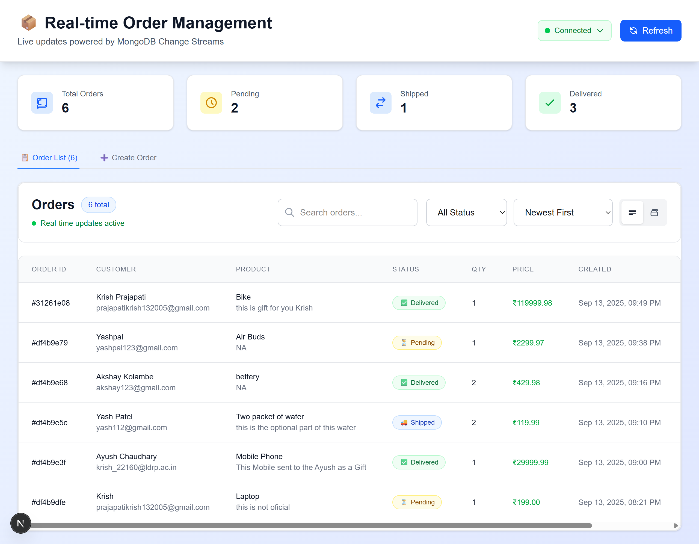
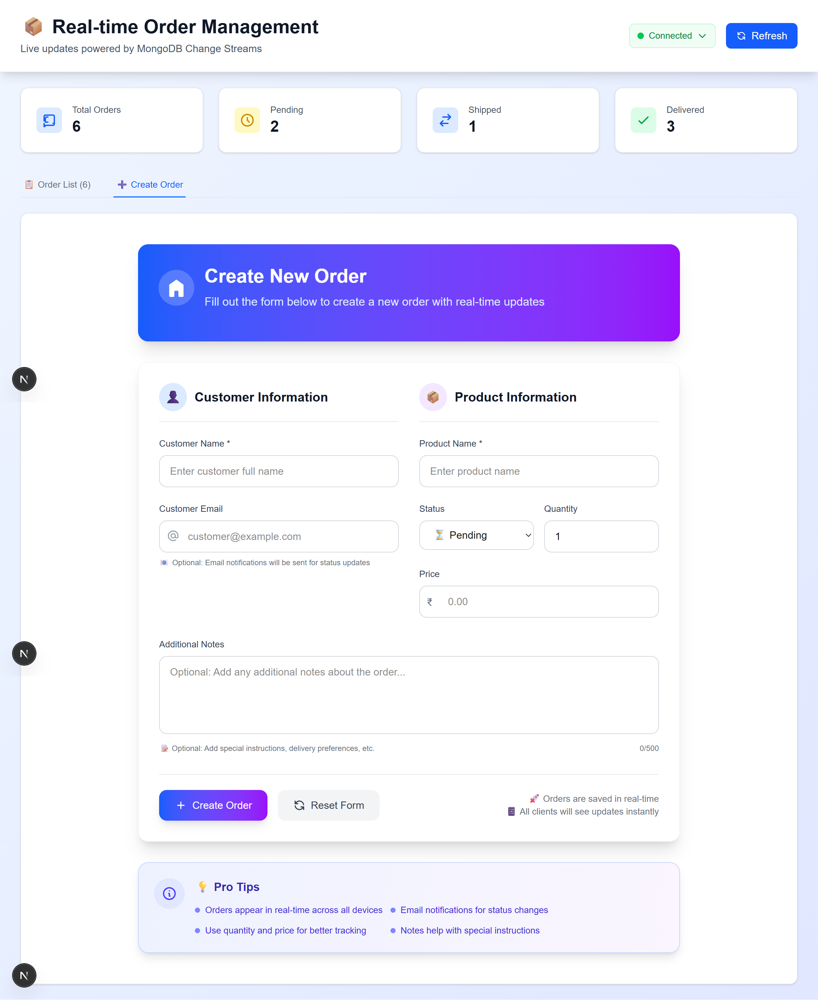

# 🚀 Real-time Order Management System

A modern order management system with real-time updates, automated email notifications, and live synchronization across all connected clients.

## Images




## ✨ Features

- **Real-time Updates**: Instant order synchronization using MongoDB Change Streams
- **Email Notifications**: Automated notifications for order status changes
- **Live Dashboard**: Real-time order status indicators
- **RESTful API**: Complete CRUD operations for order management
- **Modern UI**: Clean, responsive interface built with Next.js

## 🏗️ Architecture

```
┌─────────────┐    ┌──────────────┐    ┌─────────────┐
│   Next.js   │◄──►│   Node.js    │◄──►│  MongoDB    │
│  Frontend   │    │   Backend    │    │  Database   │
└─────────────┘    └──────────────┘    └─────────────┘
      │                     │                    │
      └── WebSocket ────────┘                    │
                                                 │
┌─────────────┐    ┌──────────────┐              │
│   Email     │◄───│   Change     │◄─────────────┘
│  Service    │    │   Streams    │
└─────────────┘    └──────────────┘
```

## 📁 Project Structure

```
real-time-order-system/
├── backend/
│   ├── src/
│   │   ├── config/
│   │   │   ├── database.js
│   │   │   └── email.js
│   │   ├── models/
│   │   │   └── Order.js
│   │   ├── routes/
│   │   │   └── orders.js
│   │   ├── services/
│   │   │   ├── changeStreamService.js
│   │   │   ├── emailService.js
│   │   │   └── websocketService.js
│   │   └── server.js
│   ├── package.json
│   └── .env
├── frontend/
│   ├── src/
│   │   ├── app/
│   │   │   ├── page.js
│   │   │   └── layout.js
│   │   ├── components/
│   │   │   ├── OrderForm.jsx
│   │   │   ├── OrderList.jsx
│   │   │   └── RealTimeStatus.jsx
│   │   ├── hooks/
│   │   │   └── useWebSocket.js
│   │   └── services/
│   │       └── api.js
│   ├── package.json
│   └── next.config.js
└── README.md
```

## 🛠️ Tech Stack

**Backend**

- Node.js + Express.js
- MongoDB with Change Streams
- Socket.IO for WebSocket
- Nodemailer for emails

**Frontend**

- Next.js 15
- React 19
- Socket.IO Client
- Tailwind CSS

## ⚡ Quick Setup

### Prerequisites

- Node.js (v18+)
- MongoDB (v4.0+ with replica set)
- Gmail account for email notifications

### Installation

1. **Clone & Install**

```bash


# Install backend dependencies
cd backend
npm install

# Install frontend dependencies
cd ../frontend
npm install
```

2. **Setup MongoDB Replica Set**

```bash
# Start MongoDB with replica set
mongod --replSet rs0 --dbpath /data/db

# In MongoDB shell, initialize replica set
mongo
> rs.initiate()
```

3. **Configure Environment Variables**

Create `backend/.env`:

```env
# Database
MONGODB_URI=mongodb://localhost:27017/orderdb?replicaSet=rs0
PORT=3001

# Email (Gmail)
EMAIL_HOST=smtp.gmail.com
EMAIL_PORT=587
EMAIL_USER=your-email@gmail.com
EMAIL_PASS=your-app-password
EMAIL_FROM=your-email@gmail.com

# CORS
FRONTEND_URL=http://localhost:3000
```

4. **Start Development Servers**

```bash
# Terminal 1 - Backend
cd backend
npm run dev

# Terminal 2 - Frontend
cd frontend
npm run dev
```

Visit `http://localhost:3000` to see the application.

## 📡 API Endpoints

| Method | Endpoint          | Description      |
| ------ | ----------------- | ---------------- |
| GET    | `/api/orders`     | Get all orders   |
| POST   | `/api/orders`     | Create new order |
| PUT    | `/api/orders/:id` | Update order     |
| DELETE | `/api/orders/:id` | Delete order     |

**Example Order Object:**

```json
{
  "customer_name": "John Doe",
  "customer_email": "john@example.com",
  "product_name": "Laptop",
  "quantity": 1,
  "price": 999.99,
  "status": "pending"
}
```

## 🔄 How It Works

1. **Order Creation/Update** → API call modifies MongoDB
2. **Change Stream Detection** → MongoDB automatically detects changes
3. **Real-time Broadcasting** → WebSocket sends updates to all clients
4. **Email Notification** → Automated emails for status changes
5. **UI Updates** → Frontend updates instantly without refresh

## 🎯 Key Implementation Features

### Real-time Updates with MongoDB Change Streams

```javascript
// backend/src/services/changeStreamService.js
const changeStream = db.collection("orders").watch();
changeStream.on("change", (change) => {
  // Broadcast to all connected clients
  io.emit(`order-${change.operationType}`, change.fullDocument);

  // Send email notification if status changed
  if (change.updateDescription?.updatedFields?.status) {
    emailService.sendStatusUpdate(change.fullDocument);
  }
});
```

### WebSocket Integration

```javascript
// frontend/src/hooks/useWebSocket.js
useEffect(() => {
  socket.on("order-created", (order) => {
    setOrders((prev) => [...prev, order]);
    showNotification("New order created!");
  });

  socket.on("order-updated", (order) => {
    setOrders((prev) => prev.map((o) => (o._id === order._id ? order : o)));
  });
}, []);
```

### Automated Email Notifications

```javascript
// backend/src/services/emailService.js
const sendOrderStatusUpdate = async (order) => {
  await transporter.sendMail({
    to: order.customer_email,
    subject: `Order ${order._id} - Status Updated`,
    html: `Your order status has been updated to: ${order.status}`,
  });
};
```

### Test Real-time Features

1. Open multiple browser tabs at `http://localhost:3000`
2. Create/update an order in one tab
3. Watch instant updates appear in all other tabs
4. Check email notifications for status changes

### API Testing

```bash
# Create order
curl -X POST http://localhost:3001/api/orders \
  -H "Content-Type: application/json" \
  -d '{"customer_name":"Test User","product_name":"Test Product","customer_email":"test@example.com"}'

# Update order status
curl -X PUT http://localhost:3001/api/orders/ORDER_ID \
  -H "Content-Type: application/json" \
  -d '{"status":"shipped"}'
```

## ⚠️ Important Notes

1. **MongoDB Replica Set**: Required for Change Streams to work
2. **Gmail Setup**: Use App Password, not regular password
3. **CORS Configuration**: Update for production domains
4. **WebSocket Connection**: Ensure ports 3000/3001 are accessible

## 🔧 Common Issues & Solutions

**MongoDB Connection Error**

```bash
# Check replica set status
mongo --eval "rs.status()"
```

**Email Not Sending**

- Verify Gmail App Password
- Check SMTP settings in .env file

**WebSocket Connection Failed**

- Verify CORS settings
- Check if ports are blocked

## 🎯 Key Highlights for Assessment

✅ **Real-time Architecture**: MongoDB Change Streams + WebSocket  
✅ **Modern Tech Stack**: Next.js, Node.js, MongoDB  
✅ **Production Ready**: Error handling, logging, proper structure  
✅ **Email Integration**: Automated notifications  
✅ **Clean Code**: Modular structure, separation of concerns  
✅ **Responsive UI**: Modern, clean interface

## 📝 Future Enhancements

- User authentication & authorization
- Order search and filtering
- Analytics dashboard
- Mobile app support
- Payment gateway integration

---

**Built with ❤️ using modern web technologies**

_This project demonstrates proficiency in full-stack development, real-time systems, and modern JavaScript frameworks._
